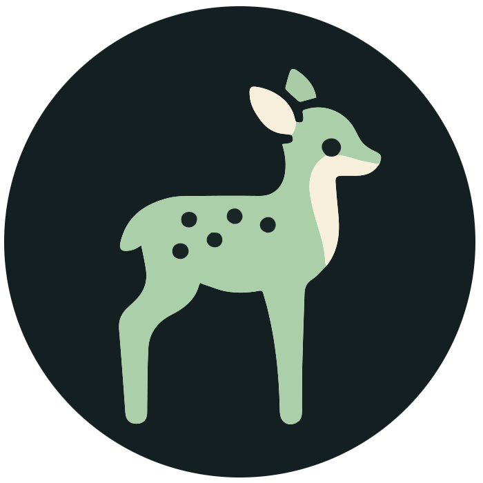

<br />
<p align="center">
<a></a>
  <h3 align="center">FawnRescue</h3>
  <p align="center">
    Flight Computer Code<br />
    <p align="center">
  <a href="https://github.com/FawnRescue/drone/blob/main/LICENSE"></a>
  <a href="https://github.com/FawnRescue/drone/network/members"></a>
  <a href="https://github.com/FawnRescue/drone/stargazers"></a>
</p>
    <p>
    <a href="https://github.com/FawnRescue/drone/issues">Report Bug</a>
    ·
    <a href="https://github.com/FawnRescue/drone/issues">Request Feature</a>
    </p>
    <a href="https://fawnrescue.github.io/">Website</a>
  </p>
</p>

Welcome to the FawnRescue Drone project! This repository houses the codebase for a drone designed to execute specialized missions autonomously with a focus on wildlife rescue operations. Our software is developed in Kotlin for the drone's primary operations and Python for the camera server, ensuring a robust system capable of navigating and performing tasks with high efficiency and reliability.

## Quick Start

1. **Clone the Repository**

    ```
    git clone https://github.com/FawnRescue/drone.git
    ```

2. **Set Up Secrets**

    Create a `secrets.properties` file in the root directory based on the template provided in `secrets.properties.example`.

## Setup

Before diving into the drone's operation, ensure your development environment is ready:

- **Development Toolchain**: Follow the [PX4 Development Guide](https://docs.px4.io/main/en/dev_setup/dev_env.html) to set up your development environment.
- **MAVSDK Server**: Download and set executable permissions:

    ```bash
    wget https://github.com/mavlink/MAVSDK/releases/download/v2.4.1/mavsdk_server_musl_x86_64
    chmod +x mavsdk_server_musl_x86_64
    ./mavsdk_server_musl_x86_64
    ```

## Running the Simulator

To simulate the drone's flight:

1. Open a new console and navigate to the PX4-Autopilot directory:

    ```bash
    cd PX4-Autopilot
    make px4_sitl gz_x500
    ```

2. Run the code in this repository.

## Installation

### Use Our Provided Image

(Instructions to be added)

### Manual Installation

#### Python Camera Server

- **Install OpenCV**: `apt install python-opencv`
- **Install SeekCamera Drivers**: (Link to installation guide)

#### Services

- **Install MAVLink Router**: Visit [MAVLink Router](https://github.com/mavlink-router/mavlink-router) for installation instructions.
- **Adjust Executable Paths** in service files.
- **Deploy Services**: Copy and enable custom services:

    ```bash
    cp services/* /etc/systemd/system
    systemctl enable <service-name>
    ```

- **Restart the Drone** to apply changes.

## Bluetooth Authentication

Authentication with our app is handled via a dedicated [Bluetooth repository](https://github.com/FawnRescue/bluetooth). This is crucial for ensuring that the drone is operated securely and only by authorized users.

## About the Software

### Flight Computer Software

The core of our project, the Flight Computer Software, manages a wide array of tasks from command execution, telemetry data processing, to handling connectivity issues. It is built with resilience and security in mind.

#### Key Features:

- **Authentication Workflow**: Initiates with a BLE server for secure app communication, involving OTP exchange for backend verification.
- **Flight Controller Handler**: Integrates with MAVSDK Java for flight control and telemetry monitoring.
- **Supabase Handler**: Manages data exchange with Supabase for real-time telemetry and command processing.
- **Reconnection Workflow**: Ensures the drone remains operational through dynamic connectivity conditions by actively monitoring and attempting reconnections.

## Contributing

We welcome contributions! If you're interested in improving the FawnRescue Drone project, please read our CONTRIBUTING.md file for guidelines on how to submit changes.

## License

This project is licensed under the MIT License - see the [LICENSE](LICENSE) file for details.
